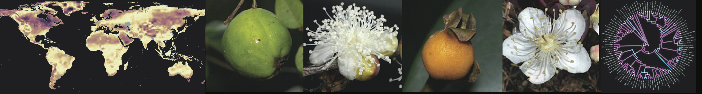

{ width=100% }

#
Traits, distribution and diversification
  
I am a botanist with great passion for evolutionary biology and biogeography. My daily work consists of investigating (1) why plant species are where they are and look how they look and then (2) why some areas and clades are much more species-rich than others.
  
Because these questions are multidisciplinary in nature, I have combined three main lines of research along my career to address them (see also [publications](tncvasconcelos.github.io/publications.html) for examples).  
  
  
**(1) Lineage-focused studies (systematics)**: What are the relationships among the species of flowering plants? Myrtaceae is the family I know best and have contributed most to, but I am very much interested in other lineages too.
  
**(2) Area-focused studies (biogeography)**: Where these species occur? The neotropics is the area I understand best, but I have been also very interested in patterns of global species distribution.
  
**(3) Trait-focused studies (morphology and trait-evolution)**: What traits characterize these lineages? Floral traits are probably the ones I know best, but I have been really interested in traits related to dispersal (fruits, seeds) and survival (life form, leaves) too.
  
I am now particularly interested in questions that integrate all three topics described above. For instance, what are the spatial gradients of diversity in flowering plants and what causes them? Why some traits are more common in some areas and how these trait-area combinations drive distribution and diversification of flowering plants through time?
  
What underpins these questions is the inference of increasingly robust phylogenetic trees, assembly and curation of large trait and distribution datasets and development of new comparative and macroevolutionary methods that deal better with the complexity of biological evolution. Development of new, biologically realistic methods and analyses of large datasets are good descriptions of my current project as a postdoc at the [Beaulieu lab](https://www.jeremybeaulieu.org) and I'm looking forward to keep exploring these topics in the future.  

{ width=40% }

