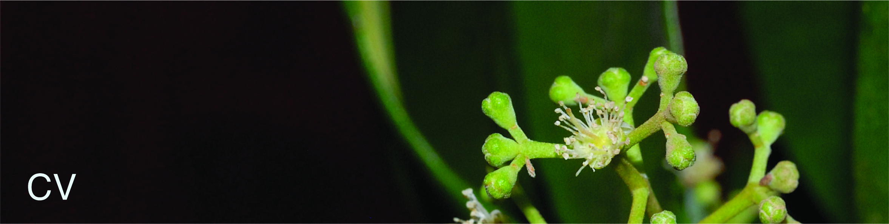

#
  
# Qualifications

- BSc - Universidade de Brasilia (Brazil), 2007 - 2011  
- MSc - Universidade de Brasilia (Brazil), 2011 - 2013  
- PhD - Royal Botanic Gardens, Kew / University College London (UK), 2013 - 2017  
- Postdoc - Universidade de São Paulo (Brazil), 2018 - 2020  
- Postdoc - University of Arkansas (USA), 2020 - present  
  
# Associate editor  
  
- Plant Systematics and Evolution, 2019 - present  
- Botanical Journal of the Linnean Society, 2020 - present  
 
# Teaching

- Systematic Botany – undergraduate course  
Universidade de Brasilia, Brazil – 2012  
(Teaching Assistant)  
  
- Ecology and evolution of plant-pollinator interactions – short course  
Universidade de Brasilia, Brazil – 2018  
(Instructor)  
  
- Macroevolution – part of the graduate course in “Molecular ecology”  
UNESP Rio claro, Brazil – 2018  
(Instructor)  
  
- Biogeography of the Neotropical region – short course  
Unicamp, Brazil – 2018  
(Instructor)  
  
- Biogeography and diversification of the Neotropical biota - undergraduate course  
Universidade de São Paulo, Brazil – 2019  
(Teaching Assistant)  
  
  
    
# CV  
For a complete list of invited talks, grants and other qualifications, see my full CV below.
  
<a href="TVasconcelos_CV_July_2021.pdf#" class="download" style="color:blue" title="Download CV as PDF">Download my complete CV here</a>	