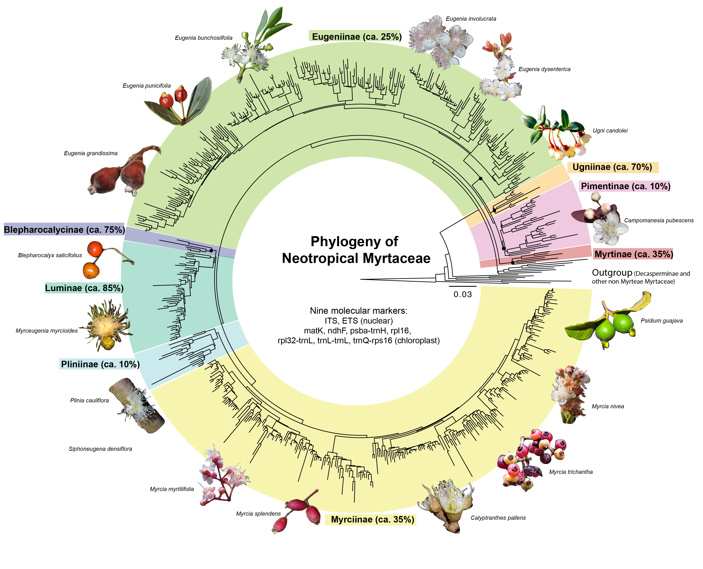
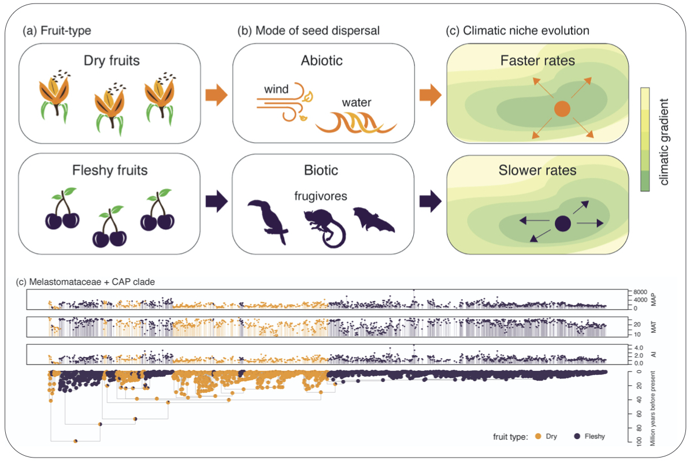

  
  
<html>
  <head>
    
  </head>
<body>

<h1> </h1>

</body>
</html>

    

   Welcome! 

  

   We are botanists at the Department of Ecology and Evolutionary Biology, University of Michigan - Ann Arbor! 

  
  
  

    

    

<h1>News</h1>  
  
<body>  
 

 **April 29th, 2025**   
Please share with anyone who might be interested: applications for the graduate program at the Department of Ecology and Evolutionary Biology at the University of Michigan will be open **between early September and December 1st, 2025**, with activities starting in August 2026. 
  
I'm looking for a PhD student to join the lab this year! Our work is mostly focused on systematics and functional biogeography of angiosperms. More details can be found on the department's website https://lsa.umich.edu/eeb/graduates/prospective-students/eeb-application-information.html 

  Prospective students are advised to answer the questionnaire on [this link](https://forms.gle/wB5qovSdwPob3Mnh6) before emailing me. 
  
  Thank you!
  
  

    

    

    

<h1>Our research</h1>  
  
<body>  
 

Currently, research in our lab is focused on two key areas: 
  

{}

  

 **Systematics, evolution, and ecology of Myrtaceae** 

 
  
We study plant ecology and evolution in understudied tropical regions, with a particular focus on neotropical myrtles (tribe Myrteae, Myrtaceae). We use a range of methods and data including trait measurements, biogeographical analyses and phylogenetic inferences to gain a comprehensive understanding of how the environment has influenced the evolution of this plant group and how different Myrteae lineages are related to one another. 
  

    
  

{}

 

 **Discovering the rules of plant biogeography using a trait-based approach**   

 
  
We use natural history collections and trait characterization tools to gather large sets of occurrence data and functional traits. These datasets are then combined with molecular phylogenies and phylogenetic comparative methods to quantify the correlation between traits and environments throughout the evolution of flowering plants. Our goal is to utilize trait-environment correlation analyses to uncover general patterns in plant biogeography by measuring how unrelated plant lineages have evolved similar traits in response to a specific environment.
</body>

