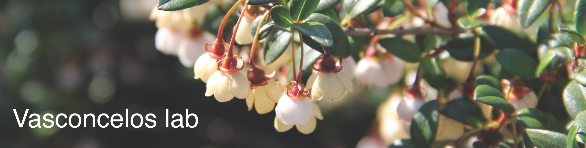

  
  
<html>
  <head>
    
  </head>
<body>

<h1> </h1>

</body>
</html>

    

   Welcome! 

  

   We are botanists based at the Department of Ecology and Evolutionary Biology, University of Michigan - Ann Arbor! 

  
  

    

<h1>News</h1>  
July 18 2022  

**I'm on the look out for grad students to join the lab in the Fall of 2023!**
I’m actively looking for grad students to join the recently started Vasconcelos lab at the EEB Department - University of Michigan. If you are passionate about plants, evolution, biogeography, natural history collections, or all of the above, this may be your place : )

**The graduate school application deadline for the EEB Department is the 1st December (2022) for a Fall 2023 start**. Please check [this link](https://lsa.umich.edu/eeb/graduates/prospective-students.html) for more information about the program and [this link](https://lsa.umich.edu/eeb/graduates/prospective-students/eeb-application-information.html) on how to apply. 

In our first years, we will be mainly focused on the two lines of research described below. Prospective students are encouraged to contact me at tvasc@umich.edu to start conversation about a potential alignment of interests before applying. It is not too early to begin a conversation about future projects!
  
I will also be hiring a two-year postdoc to join the lab in 2023 -- details on this position will be posted here soon.  

    

    

<h1>Our research</h1>  
  
<body>  
 

Currently, our lab is focusing on two main lines of research: 
  

{}

  

 **Systematics, evolution, and ecology of Myrtales** 

 
  
We are interested in understanding the evolution of plants in poorly studied tropical areas and groups, mainly focused on lineages within the order Myrtales (guavas, pomegranates, cloves). We have several collaborators based in Brazil and the UK working together on this line of research and there is plenty of opportunity for international collaboration and fieldwork for prospective students and postdocs.

  

    
  

{}

 

 **Discovering the rules of plant biogeography using a trait-based approach**   

 
  
Trait-environment correlation analyses are ways to discover general patterns in plant biogeography by quantifying to what extent unrelated lineages have similar evolutionary responses to a given environment
In this line, we use natural history collections and trait characterization tools to build comprehensive datasets of occurrence points and functional traits. We combine these datasets with molecular phylogenies and phylogenetic comparive methods to quantify trait-environment correlations through flowering plant evolution. 

  
</body>

