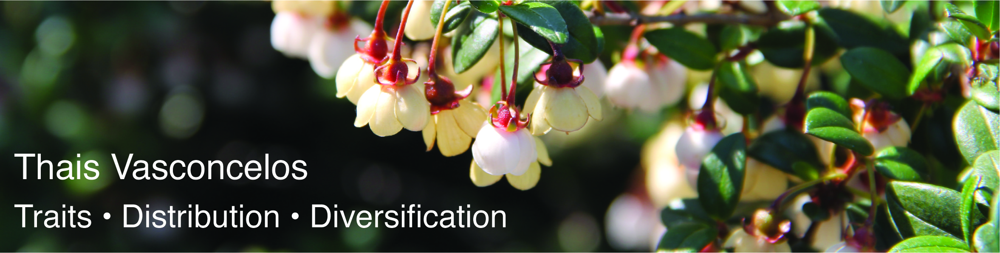

  
  
#  
#  

**I'm looking for grad students to join the lab this winter (selection December 2022)! If you are passionate about plants, biogeography, evolution, and natural history collections, this is your place! Prospect students feel free to contact me at xxx. Let's chat :)**
------------------------------------------------------------------------------------------
  
  
Welcome!  
We are botanists based at the University of Michigan in Ann Arbor!  

Our lab focuses on investigating the evolution and biogeography of flowering plants, with the aim to understand (1) why plants are where they are and look how they look and (2) why some areas and clades are more species-rich than others. 
  
Because these questions are multidisciplinary in nature, we combine three main lines of research to address them (see also [publications](tncvasconcelos.github.io/publications.html) for examples):
  
**(1) Lineage-focused studies (systematics)**: What are the relationships among the species of flowering plants? 
  
**(2) Area-focused studies (biogeography)**: Where do these species occur?
  
**(3) Trait-focused studies (morphology and trait-evolution)**: What traits characterize these lineages? 
  
We're particularly interested in questions that integrate all three topics above. We're also particularly excited to learning more about poorly known plant lineages in the tropics. 

