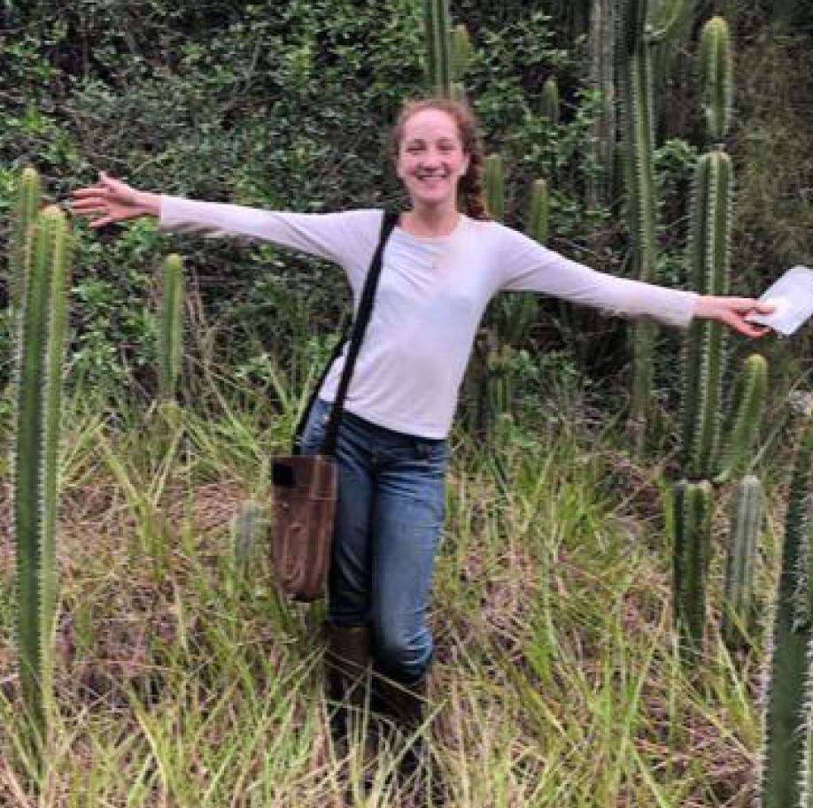

  

    
  
  
 The lab   
  
  
  

  

{}  
  
Thais Vasconcelos  
(Principal Investigator)  
My work centers around the intersection of traits, geographical distribution, and diversification in the plant world. My long-term goal is to gain a comprehensive understanding of how these factors interact and shape the evolution of flowering plants. (my first name is pronounced "tah-EES") <a href="ThaisVasconcelos_CV_Aug2024.pdf#" class="download" style="color:blue" title="Download CV as PDF">CV here</a>	 tvasc@umich.edu  | [Thais' GitHub](https://github.com/tncvasconcelos) | [Thais' Twitter](https://twitter.com/TNCVasconcelos) | [Thais' Google scholar](https://scholar.google.com/citations?user=bpkWIywAAAAJ&hl=en&oi=ao) 
  

  

{}  
  
Aline Martins  
(Postdoctoral Fellow)  
I am an entomologist, largely influenced by botanists, who was always fascinated by plant-pollinator interactions and evolution. The most important question of my research is how bees and plants mutually influenced their evolution in time and space and which traits have played a role in this long-term mutualism. My main group of study are bees in the family Apidae, but also other bee groups and plants. maline@umich.edu | [Aline's Website](https://martinsaline.weebly.com) | [Aline's Research Gate](https://www.researchgate.net/profile/Aline-Martins-14) | [Aline's Twitter](https://twitter.com/alinecmar)

  

{}  
  
Lena Heinrich  
(PhD student)   
I am broadly interested in plant-pollinator interactions, evolution, and behavioral ecology. I completed my BA in Zoology and minor in Plant Biology in 2022, at the University of Vermont. My undergraduate research projects included studying the genetic control of flowering phenology, the development of nectar-producing glands, and the impacts of parasitism risk by wasps on the nesting behavior of solitary bees. Here at the University of Michigan, I will be working with Thais and Aline to study patterns and drivers of bee diversity, with a particular focus on nesting ecology and mutualisms with flowering plants. lenarh@umich.edu
  

  

{}  

  
  
  

 
{}  
Paulo Henrique Gaem, MSc  
(PhD student)  
I am interested in systematics and evolution of highly diverse tropical plant lineages. My work is focused on the Neotropical region, with the hyper-diverse woody genus *Myrcia* DC. (Myrtaceae) as a model. I have a bachelor’s degree in Forest Engineering and a master’s degree in Plant Biology, both obtained in Brazil. I’m currently a PhD student at the Ecology and Evolutionary Biology department of the University of Michigan, Ann Arbor. In this new step, I intend to explore the diversification patterns and build on the systematic knowledge of the still poorly understood lineage *Myrcia* section *Aulomyrcia* (O.Berg) Griseb. phgaem@umich.edu | [Paulo's Research Gate](https://www.researchgate.net/profile/Paulo-Henrique-Gaem) | [Paulo's Google scholar Gate](https://scholar.google.com/citations?user=0mWvvX0AAAAJ&hl=pt-BR)
  

  

{}  
  
  

  

{}  
  
  
 

  

    

 co-advised grad students | collaborations   

{}  
  
Sandra Reinales, MSc  
(PhD student, USP-Brazil)  
Sandra is a botanist interested in systematics, biogeography and morphological evolution, in a macroevolutionary context. Currently, she is a PhD student at USP (Brazil) under the supervision of Dr. José Rubens Pirani, where she studies diversification dynamics in the tribe Sauvagesieae (Ochnaceae). She is testing some mechanisms (e.g. dispersal capacity) that could explain the unbalanced species richness and the recent geographical distribution of Neotropical Ochnaceae, focusing on the montane areas of South America. In her spare time Sandra is also interested in historical collections of Colombian botanists. spreinales@gmail.com | [Sandra's Research Gate](https://www.researchgate.net/profile/Sandra_Reinales) | [Sandra's Twitter](https://twitter.com/spreinales)
  

  

{}  
  
Patrícia Sperotto, MSc  
(PhD student, UFRGS-Brazil)  
Patrícia earned her MSc. from the UEFS (Brazil) working with systematics and macroevolution of neotropical climbing plants, especially focusing on the role of climbing mechanisms in their diversification. Currently, she is a PhD student at UFRGS (Brazil) under the supervision of Dr. Marcelo Reginato and her project involves exploring the influence of cytogenetic characteristics (e.g., WGD events, polyploidy and genome size) and morphological traits in the macroevolutionary dynamics, geographic distribution and niche occupation of Melastomataceae.  patriciassperotto@gmail.com | [Patricia's twitter](https://twitter.com/P_Sperotto) | [Patricia's ResearchGate](https://www.researchgate.net/profile/Patricia_Sperotto) 
  

  

{}  
  
Yacov Kilsztajn, MSc  
(MSc student, UFRN-Brazil)  
 Yacov is doing his master's under supervision of Dr. Vanessa Staggemeier. He is working with trait evolution and biome shifts in Myrteae (Myrtaceae). Specifically, he is measuring which of two processes -- pre-adaptation followed by biome shift, or biome shift followed by adaptation -- are prevalent in the group. ykilmail@gmail.com 
  

  

{}  

  

{}  
  
Milena Telhe  
(PhD student, UFSCar-Brazil)  
My main scientific interest revolves around understanding the evolutionary processes shaping diversity, especially within the Neotropical region. As a Ph.D. student, I am passionately engaged in exploring the rich biodiversity and the evolutionary dynamics in the arid regions of the Neotropics, using cacti as a lens to examine these dry and enigmatic landscapes. milena.telhe@gmail.com
  

  

{}  
  

  

  

{}  
  
  
 
  

  

  

   

  
   

  

{ width=100% }  

  

