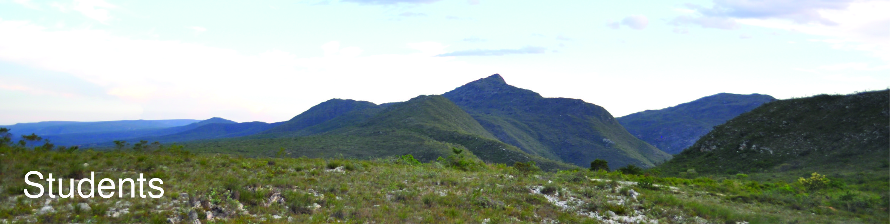
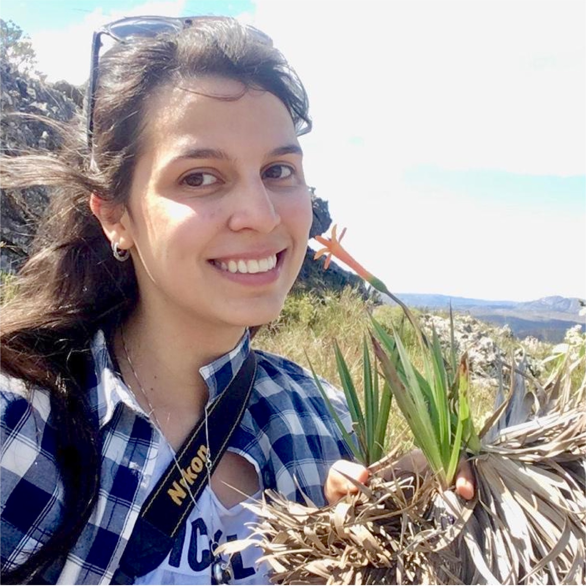
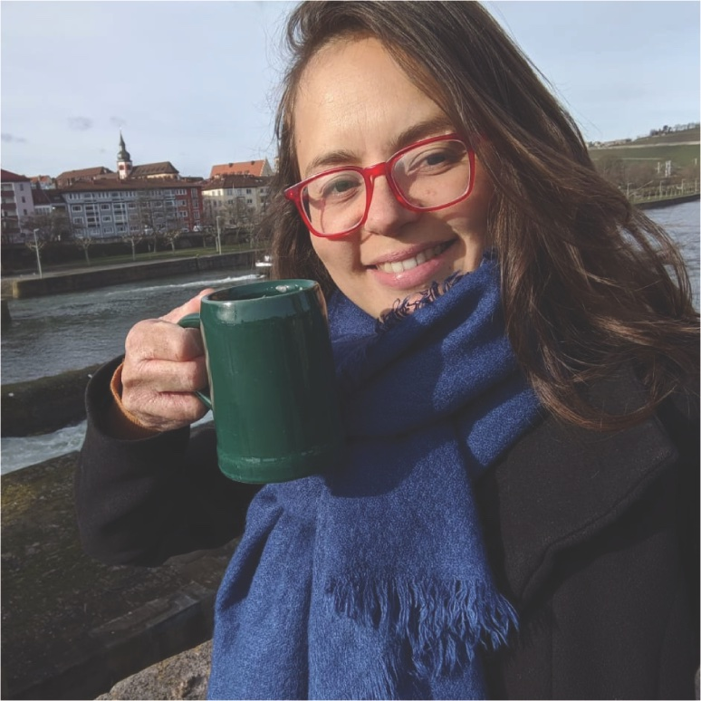
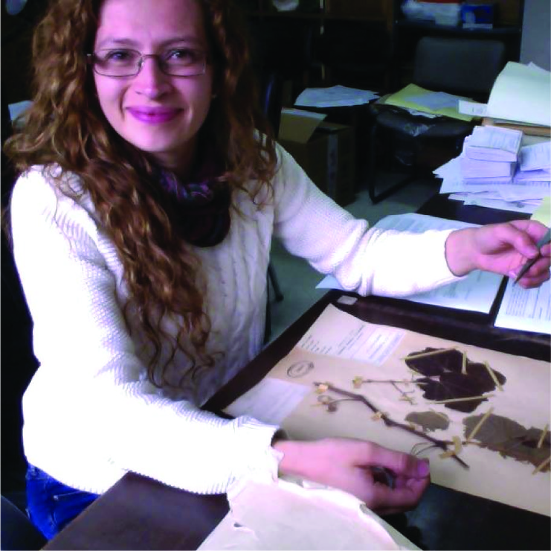
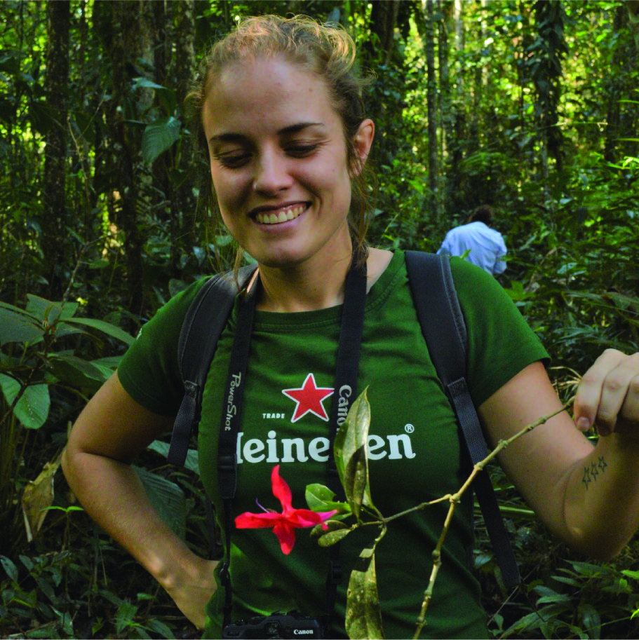

  

    
  
  
 The lab   
  
  
  

  

{}  
  
Thais Vasconcelos  
(Principal Investigator)  
My work centers around the intersection of traits, geographical distribution, and diversification in the plant world. My long-term goal is to gain a comprehensive understanding of how these factors interact and shape the evolution of flowering plants. (my first name is pronounced "tah-EES") <a href="ThaisVasconcelos_CV_Jan2023.pdf#" class="download" style="color:blue" title="Download CV as PDF">CV here</a>	 tvasc@umich.edu  | [Thais' GitHub](https://github.com/tncvasconcelos) | [Thais' Twitter](https://twitter.com/TNCVasconcelos) | [Thais' Google scholar](https://scholar.google.com/citations?user=bpkWIywAAAAJ&hl=en&oi=ao) 
  

  

{}  
  
Aline Martins  
(Postdoctoral Fellow)  
I am an entomologist, largely influenced by botanists, who was always fascinated by plant-pollinator interactions and evolution. The most important question of my research is how bees and plants mutually influenced their evolution in time and space and which traits have played a role in this long-term mutualism. My main group of study are bees in the family Apidae, but also other bee groups and plants. maline@umich.edu | [Aline's Website](https://martinsaline.weebly.com) | [Aline's Research Gate](https://www.researchgate.net/profile/Aline-Martins-14) | [Aline's Twitter](https://twitter.com/alinecmar)

  

{}  
  
  

  

    
  
  
 co-advised grad students | collaborations   
  

{}  
  
Sandra Reinales, MSc  
(PhD student, USP-Brazil)  
Sandra is a botanist interested in systematics, biogeography and morphological evolution, in a macroevolutionary context. Currently, she is a PhD student at USP (Brazil) under the supervision of Dr. José Rubens Pirani, where she studies diversification dynamics in the tribe Sauvagesieae (Ochnaceae). She is testing some mechanisms (e.g. dispersal capacity) that could explain the unbalanced species richness and the recent geographical distribution of Neotropical Ochnaceae, focusing on the montane areas of South America. In her spare time Sandra is also interested in historical collections of Colombian botanists. spreinales@gmail.com | [Sandra's Research Gate](https://www.researchgate.net/profile/Sandra_Reinales) | [Sandra's Twitter](https://twitter.com/spreinales)
  

  

{}  
  
Lílian Melo, MSc  
(PhD student, UFU-Brazil)  
Lílian is a PhD student in Ecology at UFU (Brazil) under the supervision of Dr. Vinicius Brito. She is interested in plant-pollinator interactions and macroevolutionary questions related to this topic. Currently, her research is mainly focused on the classification, evolution and distribution of species with pollen flowers. lilian.melo@ufu.br | [Lilian's Google Scholar](https://scholar.google.com.br/citations?hl=pt-BR&user=EpdBsl4AAAAJ) | [Lilian's Twitter](https://twitter.com/LilianRFMelo) | [Lilian's ResearchGate](https://www.researchgate.net/profile/Lilian_Rodrigues_Ferreira_De_Melo) 

  

  

{}  
  
Patrícia Sperotto, MSc  
(PhD student, UFRGS-Brazil)  
Patrícia earned her MSc. from the UEFS (Brazil) working with systematics and macroevolution of neotropical climbing plants, especially focusing on the role of climbing mechanisms in their diversification. Currently, she is a PhD student at UFRGS (Brazil) under the supervision of Dr. Marcelo Reginato and her project involves exploring the influence of cytogenetic characteristics (e.g., WGD events, polyploidy and genome size) and morphological traits in the macroevolutionary dynamics, geographic distribution and niche occupation of Melastomataceae.  patriciassperotto@gmail.com | [Patricia's twitter](https://twitter.com/P_Sperotto) | [Patricia's ResearchGate](https://www.researchgate.net/profile/Patricia_Sperotto) 
  

{}  

  
{}  
  
Thiago Fernandes, MSc  
(PhD student, JBRJ-Brazil)  
Thiago is a PhD student in Botany at the Rio de Janeiro Botanic Garden interested in systematics and conservation and under the supervision of Dr. João M. A. Braga. His studies are focused on Neotropical Myrtaceae, specifically the megadiverse genus *Myrcia*. He is currently working on a taxonomic account of *Myrcia* species occurring in the Brazilian state of Rio de Janeiro along with spatial biodiversity analyses applied to the conservation of the Alantic Forest. Another research interest is to investigate the spatial distribution of floral traits in Atlantic Forest *Myrcia*. thiagofernandes@id.uff.br | [Thiago's ResearchGate](https://www.researchgate.net/profile/Thiago-Fernandes-5) 
  

  

  
{}  
  
Hercilia Cunha  
(MSc student, UFRN-Brazil)  
Hercília is a MSc student in Ecology at PPGECO/UFRN under the supervision of Dr. Vanessa Staggemeier. In her project, she aims to answer the question "What fruits and seeds of Myrtaceae can reveal about the success of this family in the Neotropics?". She is interested in patterns associated with seed dispersal in Myrtaceae, such as size and color of seeds and fruits. She seeks to understand whether these patterns can explain the diversification of this group. herciliad7@gmail.com | [Hercilia's twitter](https://twitter.com/hercilia_cunha) | [Hercilia's ResearchGate](https://www.researchgate.net/profile/Hercilia-Da-Cunha-2) | [Hercilia's ORCID](https://orcid.org/0000-0002-1152-5799) 

  

  

{}  

   

  
   

  

{ width=100% }  

  

