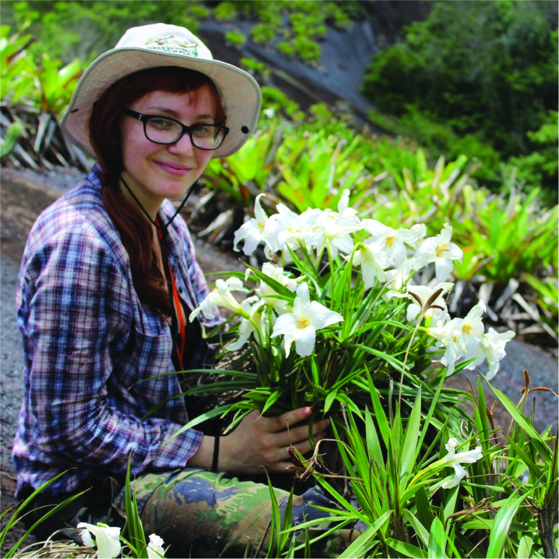
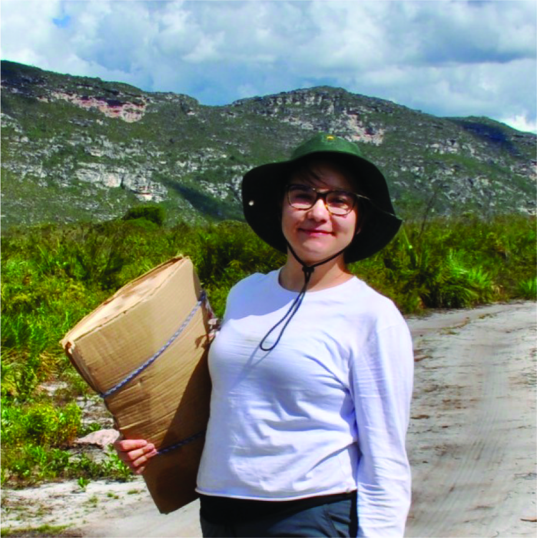
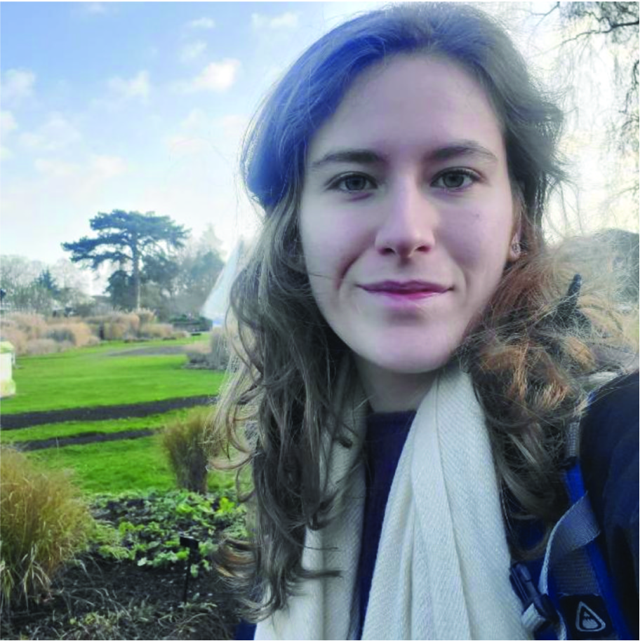

    
  
  
 supervisions | co-supervisions | collaborations  
  
  
  

  

{}  
  
Sandra Reinales, MSc  
(ICN-UN, Colombia)  
Sandra is a botanist interested in systematics, biogeography and morphological evolution, in a macroevolutionary context. Currently, Sandra is a PhD student at USP (Brazil), where she studies diversification dynamics in the tribe Sauvagesieae (Ochnaceae). She is testing some mechanisms (e.g. dispersal capacity) that could explain the unbalanced species richness and the recent geographical distribution of Neotropical Ochnaceae, focusing on the montane areas of South America. In her spare time Sandra is also interested in historical collections of colombian botanists. spreinales@gmail.com | [Sandra's Research Gate](https://www.researchgate.net/profile/Sandra_Reinales) | [Sandra's Twitter](https://twitter.com/spreinales)
  

  

{}  
  
Lílian Melo, MSc  
(UFU, Brazil)  
Lílian is a PhD student in ecology with a great interest in plant-pollinator interactions and macroevolutionary questions related to this topic. Currently, her research is mainly focused on the classification, evolution and distribution of species with pollen flowers. lilian.melo@ufu.br | [Lilian's Google Scholar](https://scholar.google.com.br/citations?hl=pt-BR&user=EpdBsl4AAAAJ) | [Lilian's Twitter](https://twitter.com/LilianRFMelo) | [Lilian's ResearchGate](https://www.researchgate.net/profile/Lilian_Rodrigues_Ferreira_De_Melo) 

  

  

{}  
  

Andressa Cabral, MSc  
(USP, Brazil)  
Andressa is a botanist interested in systematics, biogeography and evolution of plants in island-like systems. In her MSc, she studied biogeography, morphological diversity and phylogenetic relationships in *Barbacenia* (Velloziaceae), a disjunct lineage in *campo rupestre* and Atlantic Forest inselberg. She also performed a taxonomic revision for a *Barbacenia* Atlantic Forest inselberg clade. In her PhD, she will study diversification dynamics and disjunct distribution of plant biodiversity in Neotropical mountains using *Agarista* and *Gaylussacia* (Ericaceae) as a model. acabral@outlook.com.br | [Andressa's Google Scholar](https://scholar.google.com/citations?hl=pt-BR&user=Q1WLkxYAAAAJ) | [Andressa's ResearchGate](https://www.researchgate.net/profile/Andressa_Cabral3) 

  

  

{ width=100% }  

  

{}  

  

  

{ width=100% }  

  

  
{}  
  

Patrícia Sperotto, MSc  
(UEFS, Brazil)  
Patrícia is a botanist whose research focuses primarily on climbing plants. In her MSc, she revised the terminology used to describe the climbing habit and explored the role of climbing mechanisms (e.g., tendrils, twining stems, prehensile petioles) in the evolution, diversification and distribution of neotropical climbing plants. She is currently looking for a PhD to further develop her skills in macroevolution, phylogenetic comparative methods and biogeography. patriciassperotto@gmail.com | [Patricia's twitter](https://twitter.com/P_Sperotto) | [Patricia's ResearchGate](https://www.researchgate.net/profile/Patricia_Sperotto) 

  

  
{}  
  
Mirian Antonicelli  
(USP, Brazil)  
Mirian is an undergraduate student in Biology and passionate about evolution and the mechanisms behind species diversity and distribution. She is currently investigating how biome shifts affect trait evolution in a lineage of plants using the morphological evolution in leaves of *Pleroma* (Melastomataceae) as a study case. She is also very interested in education and conservation. mirian.antonicelli@usp.br

  

{}  

Raquel Pizzardo  
(USP, Brazil)  
Raquel is an undergraduate student in Biology working with species distribution modelling and approaches to combine evolutionary history with conservation policies. She is interested to explore the relationship between geographical distribution, evolutionary processes and diversification, focusing on “sky island” systems and expanding this knowledge to analyses of conservation. raquel.pizzardo@gmail.com | [Raquel's twitter](https://twitter.com/RPizzardo) | [Raquel's website](https://rpizzardo.github.io)

  
   
