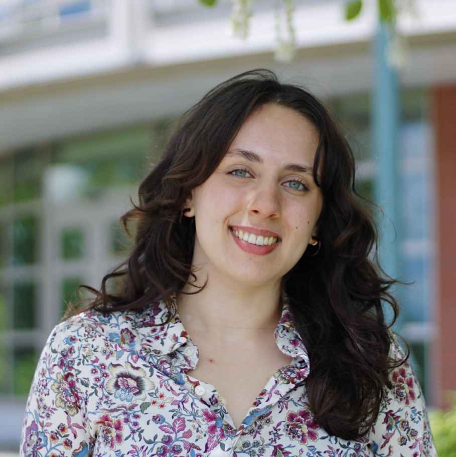
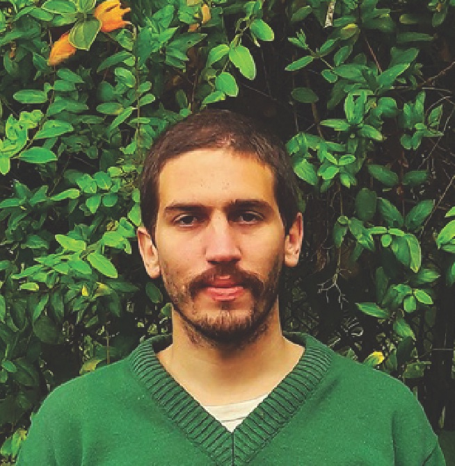

  

    
  
  
 The lab   
  
  
  

  

{}  
  
Thais Vasconcelos, PhD  
(Principal Investigator)  
The foundation of my research is to seek generalities, or “rules”, in flowering plant evolution, by focusing on the major biogeographical patterns observed in their phenotypes. (my first name is pronounced "tah-EES") <a href="ThaisVasconcelos_CV_Aug2024.pdf#" class="download" style="color:blue" title="Download CV as PDF">CV here</a>	 tvasc@umich.edu  | [Thais' GitHub](https://github.com/tncvasconcelos) | [Thais' bluesky](https://bsky.app/profile/tvasconcelos.bsky.social) | [Thais' Google scholar](https://scholar.google.com/citations?user=bpkWIywAAAAJ&hl=en&oi=ao) 
  

  

{}  
  
Lena Heinrich  
(PhD student)   
Lena is broadly interested in plant-pollinator interactions, evolution, and behavioral ecology. Her work aims to explore the ecological and evolutionary drivers of functional and life history trait variation in bees and investigate how these traits mediate interactions between bees and plants across different environments. lenarh@umich.edu
  

  

{}  
  
Paulo Henrique Gaem, MSc  
(PhD student)  
Paulo is interested in systematics and evolution of highly diverse tropical plant lineages. His work aims to investigate the relationship between traits and the environment, phylogenetic relationships, biogeography, and trait divergence between sister taxa in neotropical myrtles (Myrtaceae, Myrteae), a hyper-diverse and
 morphologically homogeneous lineage. phgaem@umich.edu | [Paulo's Research Gate](https://www.researchgate.net/profile/Paulo-Henrique-Gaem) | [Paulo's Google scholar](https://scholar.google.com/citations?user=0mWvvX0AAAAJ&hl=pt-BR)
  

  
  
  

{}  
Eric Hagen, PhD  
(Postdoctoral Fellow)  
Eric's research interests revolve around questions at large scales in biology: big phylogenies, macroevolution over millions of years, global biogeography, etc. He approaches these problems mainly with analyses of trait evolution and diversification in plants, using statistical tools like phylogenetic comparative methods and meta-analysis. Much of his work has focused on plant evolution in response to shifts in ploidy and climate. erhagen@umich.edu | [Eric's website](https://erichagen.github.io) | [Eric's Google scholar](https://scholar.google.com/citations?user=0ewKmH8AAAAJ&hl=en&oi=ao)
  

  
  
  

 
{}  
  
  
  

  

{}  
  
  

  

{}  
  
  
 

  

    

 co-advised grad students | collaborations   

{}  
  
  
  

  

{}  
  
Patrícia Sperotto, MSc  
(PhD student, UFRGS-Brazil)  
Patrícia earned her MSc. from the UEFS (Brazil) working with systematics and macroevolution of neotropical climbing plants, especially focusing on the role of climbing mechanisms in their diversification. Currently, she is a PhD student at UFRGS (Brazil) under the supervision of Dr. Marcelo Reginato and her project involves exploring the influence of cytogenetic characteristics and morphological traits in the macroevolutionary dynamics, geographic distribution and niche occupation of Melastomataceae.  patriciassperotto@gmail.com | [Patricia's twitter](https://twitter.com/P_Sperotto) | [Patricia's ResearchGate](https://www.researchgate.net/profile/Patricia_Sperotto) 
  

  

{}  
  
Yacov Kilsztajn, MSc  
(MSc student, UFRN-Brazil)  
 Yacov is doing his master's under supervision of Dr. Vanessa Staggemeier. He is working with trait evolution and biome shifts in Myrteae (Myrtaceae). Specifically, he is measuring which of two processes -- pre-adaptation followed by biome shift, or biome shift followed by adaptation -- are prevalent in the group. ykilmail@gmail.com 
  

  

{}  

  

{}  
  

  

  

{}  
  

  

  

{}  
  
  
 
  

  

  

   

  
   

  

{ width=100% }  

  

  

 Past members:   

 
  
2023-2025: Sandra Reinales, co-mentored PhD student (USP, Brazil).   
2023-2025: Aline Martins, postdoc (UM-EEB).   
2024-2025: Aya Mortada, visiting PhD student (Unimore, Italy).  
2023,2024: Zoe Bugnaski, undergraduate student (UM-EEB).  
2023-2024: Milena Telhe, visiting PhD student (UFSCar, Brazil).  
2022-2024: Hercilia Freitas da Cunha, co-advised MS student (UFRN, Brazil).  
2020-2024: Thiago Fernandes, co-advised PhD student (JBRJ, Brazil).  
2023: Jonathan Sarasa, undergraduate student (UM-EEB).  
2023: Dahlia Rose, undergraduate student (UM-EEB).  
2023: Natalie Neumann, undergraduate student (UM-EEB).  
2023: Emily Lancaster, undergraduate student (UM-EEB).  
2019-2023: Lilian Melo, co-advised PhD student (Uppsala University, Sweden).  
2018-2020: Raquel Pizzardo, undergraduate student (USP, Brazil).  
2018-2020: Mirian Antonicelli, undergraduate student (USP, Brazil).  
  
  

    
  

