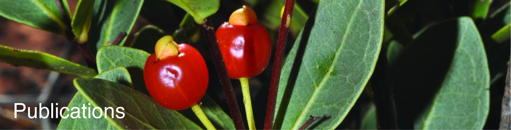
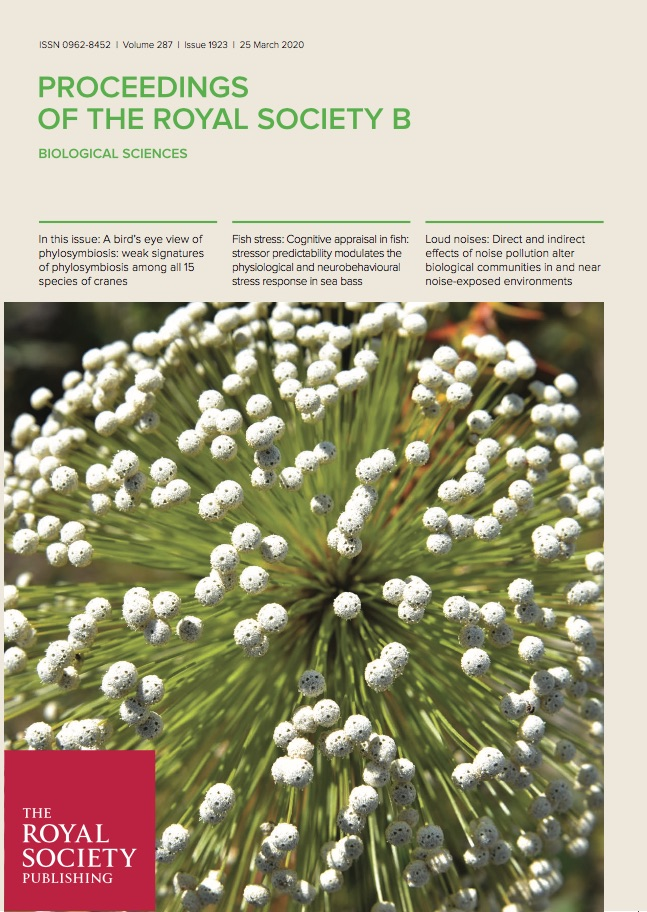
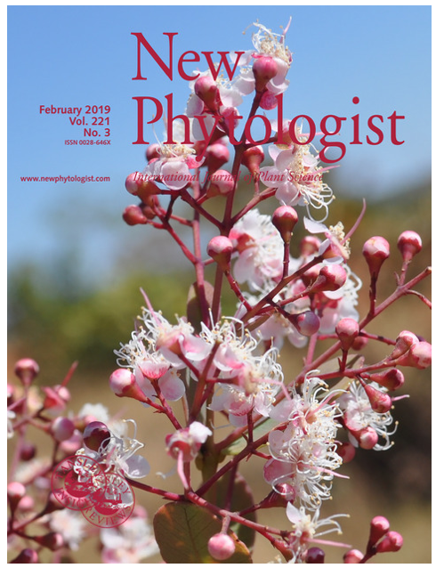

#  
#  
Peer-reviewed articles

## **2021** 
  
Maurin O, Anest A, Bellot S, Biffin E, Brewer G, Charles-Dominique T, Dodsworth S, Epitawalage N, Gallego B, Giaretta A, Goldenberg R, Gonçalves DJP, Graham S, Hoch P, Mazine F, Low YW, McGinnie C, Michelangeli FA, Morris S, Penneys DS, Pérez Escobar OA, Pillon Y, Pokorny L, Shimizu G, Staggemeier VG, Thornhill A, Tomlinson KW, Turner I, **Vasconcelos TNC**, Wilson PG, Zuntini AR, Baker WJ, Forest F, Lucas E. 2021. A nuclear phylogenomic study of the angiosperm order Myrtales, exploring the potential and limitations of the universal Angiosperms353 probe set. *American Journal of Botany* 108(7): 1087-1111 10.1002/ajb2.1699 <a href="papers/Maurinetal2021_myrtales.pdf#" class="download" style="color:black" title="">[get PDF]</a>	
  
Dantas M, Leal B, Chaves C, **Vasconcelos TNC**, Versieux L, Palma-Silva C. 2021. Underlying microevolutionary processes parallel macroevolutionary patterns in ancient Neotropical Mountains. *Journal of Biogeography* <a href="papers/Dantas-Queiroz_etal2021_micromacro.pdf#" class="download" style="color:black" title="">[get PDF]</a>
  
Melo LRF, **Vasconcelos TNC**, Reginato M, Caetano AP, Brito VLG. 2021. Evolution of stamen dimetrism in Melastomataceae, a large radiation of pollen flowers. *Perspectives in Plant Ecology Evolution and Systematics* (48) 125589 10.1016/j.ppees.2021.125589 <a href="papers/Meloetal2021_stamens.pdf#" class="download" style="color:black" title="">[get PDF]</a>
  
Lovo J, Alcantara S, **Vasconcelos TNC**, Sajo MC, Rudall PJ, Prenner G, Aguiar AJC, Mello-Silva R. 2021. Floral heterochrony and pollination biology in Trimezieae (Iridaceae): implications for evolutionary lability. *American Journal of Botany* <a href="papers/Lovoetal2021_trimezieae.pdf#" class="download" style="color:black" title="">[get PDF]</a>

Rosa PO, **Vasconcelos TNC**, Lucas EJ, Proença CEB. 2021. Revisiting Glaziou and the Botany of the second Cruls Mission: three new species and 23 accepted species of Myrcia (Myrtaceae) collected from Goiás, Brazil and a detailed description of his “Goyaz” itinerary. *Phytotaxa* <a href="papers/Rosaetal2021_glaziou.pdf#" class="download" style="color:black" title="">[get PDF]</a>
  
  
___
## **2020**  

Proença CEB, Faria JEQ, Giaretta A, Lucas EJ, Staggemeier VS, Tuler AC, **Vasconcelos TNC**. 2020. Nomenclatural and taxonomic changes in tribe Myrteae (Myrtaceae) spurred by molecular phylogenies *Heringeriana* 14(1): 49−61. <a href="papers/Proencaet al_2020_Nomenclatural changes in Myrteae.pdf#" class="download" style="color:black" title="">[get PDF]</a>	
  

{}

  

Colli-Silva M, Reginato M, Cabral A, Forzza RC, Pirani JR, **Vasconcelos TNC**. 2020. Evaluating shortfalls in biodiversity documentation for the Atlantic Forest, the most diverse and threatened Brazilian phytophysiognomic domain. *Taxon* - 10.1002/tax.12239 <a href="papers/ColliSilvaetal2020_shortfalls.pdf#" class="download" style="color:black" title="">[get PDF]</a>	

Sperotto P, Acevedo-Rodríguez P, **Vasconcelos TNC**, Roque N. 2020. Towards a standardization of the terminology for the climbing habit in plants. *The Botanical Review* - 10.1007/s12229-020-09218-y <a href="papers/Sperottoetal2020_climbers.pdf#" class="download" style="color:black" title="">[get PDF]</a>

  
Reginato M, **Vasconcelos TNC**, Kriebel R, Simões A. 2020. Is dispersal mode a driver of diversification and geographical distribution in the diverse tropical plant family Melastomataceae? *Molecular Phylogenetics and Evolution* 106815 - 10.1016/j.ympev.2020.106815 <a href="papers/Reginatoetal2020_melas.pdf#" class="download" style="color:black" title="">[get PDF]</a>
  
**Vasconcelos TNC**, Alcantara S, Andrino C, Forest F, Reginato M, Simon M, Pirani JR. 2020. Plant diversification in the highly diverse campo rupestre reveals rapid and recent radiations in ancient mountaintops. *Proceedings of the Royal Society B* 287, 20192933. - 10.1098/rspb.2019.2933 <a href="papers/Vasconcelosetal2020_camporupestre.pdf#" class="download" style="color:black" title="">[get PDF]</a>

Almeida RBP, Antar GM, **Vasconcelos TNC**, Santos LL, Amorim BS. 2020. *Myrcia lucasae* (Myrtaceae), a new species from the campo rupestre of Chapada Diamantina, Brazil. *Phytotaxa* 435 (3), 227–234. - 10.11646/phytotaxa.435.3.2 <a href="papers/Almeidaetal2020_myrcialucasae.pdf#" class="download" style="color:black" title="">[get PDF]</a>
  
Aguiar A, Melo G, **Vasconcelos TNC**, Goncalves R, Giuliano L, Martins A. 2020. Biogeography and early diversification of Tapinotaspidini oil-bees support presence of Paleocene savannas in South America. *Molecular Phylogenetics and Evolution* 143, 106692 - 10.1016/j.ympev.2020.106815 <a href="papers/Aguiaretal2020_tapino.pdf#" class="download" style="color:black" title="">[get PDF]</a>

**Vasconcelos TNC**, Lucas EJ, Conejero M, Giaretta A, Prenner G. 2020. Convergent evolution in calyptrate flowers of Syzygieae (Myrtaceae). *Botanical Journal of the Linnean Society* 192 (3), 498–509 - 10.1093/botlinnean/boz105 <a href="papers/vasconcelos_etal_syzygieae.pdf#" class="download" style="color:black" title="">[get PDF]</a>

___
## **2019**

{}

Lucas EL, Holst B, Sobral M, Mazine FF, Nic Lughadha EM, Proença CEB, **Vasconcelos TNC**. 2019. A new infra-generic classification of the predominantly South American tribe Myrteae (Myrtaceae) *Systematic Botany* 44(3): 560–569. - 10.1600/036364419X15620113920608 <a href="papers/Lucasetal2019_myrteaesubtribes.pdf#" class="download" style="color:black" title="">[get PDF]</a> 

**Vasconcelos TNC**, Prenner G, Lucas EJ 2019. A systematic overview of floral diversity in Myrteae (Myrtaceae). *Systematic Botany* 44(3): 570–591. - 10.1600/036364419X15620113920617 <a href="papers/Vasconcelosetal2019_myrteaeflowers.pdf#" class="download" style="color:black" title="">[get PDF]</a> 

Giaretta A, **Vasconcelos TNC**, Mazine FF, Faria JEQ, Flores R, Holst B, Sano PT, Lucas E. 2019. Calyx (con)fusion in a hyper-diverse genus: parallel evolution of unusual flower patterns in *Eugenia* (Myrtaceae). *Molecular Phylogenetics and Evolution* 139, 106553. - 10.1016/j.ympev.2019.106553 <a href="papers/Giarettaetal2019_calyx.pdf#" class="download" style="color:black" title="">[get PDF]</a> 

{}

Amorim BS, **Vasconcelos TNC**, Souza G, Alves M, Antonelli A, Lucas E. 2019. Advanced understanding of phylogenetic relationships, morphological evolution and biogeographic history of the mega-diverse plant genus *Myrcia* and its relatives (Myrtaceae: Myrteae). *Molecular Phylogenetics and Evolution* 138, 65–88. - 10.1016/j.ympev.2019.05.014 <a href="papers/Amorimetal2019_myrcia.pdf#" class="download" style="color:black" title="">[get PDF]</a>
  
Nic Lughadha E, Staggemeier V, **Vasconcelos TNC**, Walker B, Canteiro C, Lucas E. 2019. Harnessing the potential of integrated systematics for the conservation of taxonomically complex, megadiverse plant groups. *Conservation Biology* 33, 511–522. - 10.1111/cobi.13289 <a href="papers/NicLughadhaetal2019_harnessing.pdf#" class="download" style="color:black" title="">[get PDF]</a>

De la Estrella M, Buerki S, **Vasconcelos TNC**, Lucas E, Forest F. 2019. The Role of Antarctica in Biogeographical Reconstruction: A Point Of View. *International Journal of Plant Sciences* 180: 63–71. - 10.1086/700581 <a href="papers/Estrellaetal2019_antarctica.pdf#" class="download" style="color:black" title="">[get PDF]</a>

Colli-Silva M, **Vasconcelos TNC**, Pirani JR. 2019 Outstanding plant endemism levels strongly support the recognition of *campo rupestre* bioregions in mountaintops of eastern South America. *Journal of Biogeography* 46:1723–1733 - 10.1111/jbi.13585. <a href="papers/ColliSilvaetal2019_camporupestre.pdf#" class="download" style="color:black" title="">[get PDF]</a>

**Vasconcelos TNC**, Chartier M, Prenner G, Martins AC, Schönenberger J, et al. 2019. Floral uniformity through evolutionary time in a species-rich tree lineage. *New Phytologist* 221(3): 1597–1608 - 10.1111/nph.15453. <a href="papers/Vasconcelosetal2019_floraluniformity.pdf#" class="download" style="color:black" title="">[get PDF]</a>

___  
## **2018**

**Vasconcelos TNC**, Lucas EJ, Faria JE, Prenner G. 2018. Floral heterochrony promotes flexibility of reproductive strategies in the morphologically homogeneous genus *Eugenia* (Myrtaceae). *Annals of Botany* 121: 161–174. - 10.1093/aob/mcx142 <a href="papers/Vasconcelosetal2018_eugenia.pdf#" class="download" style="color:black" title="">[get PDF]</a>	

Mazine FF, Faria JEQ, Giaretta A, **Vasconcelos TNC**, Forest F, Lucas E. 2018 Phylogeny and biogeography of the hyper diverse genus *Eugenia* (Myrtaceae: Myrteae), with emphasis on sect. *Umbellatae*, the most unmanageable clade. Taxon 67(4): 752–769. - 10.12705/674.5 <a href="papers/Mazineetal2018_umbellatae.pdf#" class="download" style="color:black" title="">[get PDF]</a>	

BFG 2018, **Vasconcelos TNC**. 2018 Brazilian Flora 2020: Innovation and collaboration to meet Target 1 of the Global Strategy for Plant Conservation (GSPC) *Rodriguesia* 69(4): 1513–1527. - 10.1590/2175-7860201869402 <a href="papers/BFG2018.pdf#" class="download" style="color:black" title="">[get PDF]</a>	

Lucas EJ, Amorim BS, Lima DF, Lima-Lourenço AR, Nic Lughadha EM, Proença CEB, Rosa PO, Rosário AS, Santos LL, Santos MF, Souza MC, Staggemeier VG, **Vasconcelos TNC**, Sobral M. 2018. A new infra-generic classification of the species-rich Neotropical genus *Myrcia* s.l. *Kew Bulletin* 73 (1): 9. - 10.1007/S12225-017-9730-5 <a href="papers/Lucasetal2018_myrcia.pdf#" class="download" style="color:black" title="">[get PDF]</a>	

**Vasconcelos TNC**, Lucas EJ, Peguero B. 2018. One new species, two new combinations and taxonomic notes on the All-spice genus *Pimenta* (Myrtaceae) from Hispaniola. *Phytotaxa* 348 (1): 32–40. - 10.11646/phytotaxa.348.1.4 <a href="papers/Vasconcelosetal2018_pimenta.pdf#" class="download" style="color:black" title="">[get PDF]</a>	

___  
## **2017**

**Vasconcelos TNC**, Proença CE, Ahmad B, Aguilar DS, Aguilar R, Amorim BS, et al. 2017. Myrteae phylogeny, calibration, biogeography and diversification patterns: Increased understanding in the most species rich tribe of Myrtaceae. *Molecular Phylogenetics and Evolution*  109: 113–137. - 10.1016/j.ympev.2017.01.002 <a href="papers/Vasconcelosetal2017_Myrteae.pdf#" class="download" style="color:black" title="">[get PDF]</a>	
  
**Vasconcelos TNC**, Prenner G, Santos MF, Wingler A, Lucas EJ. 2017. Links between parallel evolution and systematic complexity in angiosperms: A case study of floral development in *Myrcia* s.l. (Myrtaceae). *Perspectives in Plant Ecology, Evolution and Systematics* 24: 11–24. - 10.1016/j.ppees.2016.11.001 <a href="papers/Vasconcelosetal2017_parallelism.pdf#" class="download" style="color:black" title="">[get PDF]</a>	
  
___  
## **2015**
  
**Vasconcelos TNC**, Silva JS, Ianhez ML, Proença CE. 2015. Floristic survey of the Brazilian Ages Memorial: a Cerrado *sensu stricto* area with an educational relevance. *Check List* 11(4): 1689. 10.15560/11.4.1689 <a href="papers/Vasconcelosetal2015_memorial.pdf#" class="download" style="color:black" title="">[get PDF]</a>	
  
**Vasconcelos TNC**, Proença CE. 2015. Floral cost vs. floral display: Insights from the megadiverse Myrtales suggest that energetically expensive floral parts are less phylogenetically constrained. *American Journal of Botany* 102(6): 900–909. - 10.3732/ajb.1400509 <a href="papers/Vasconcelosetal2015_myrtales.pdf#" class="download" style="color:black" title="">[get PDF]</a>	
  
**Vasconcelos TNC**, Prenner G, Bünger MO, De-Carvalho PS, Wingler A, Lucas EJ. 2015. Systematic and evolutionary implications of stamen position in Myrteae (Myrtaceae). *Botanical Journal of the Linnean Society* 179(3): 388–402. 10.1111/boj.12328 <a href="papers/Vasconcelosetal2015_stamens.pdf#" class="download" style="color:black" title="">[get PDF]</a>	
  
___  
## **2012**
  
**Vasconcelos TNC**, Silva JS, Proença CEB. 2012. Testando a função PPI: análise de previsibilidade fenológica utilizando dados de herbário. *Heringeriana* 6(1): 66–69. <a href="papers/Vasconcelosetal2012_ppi.pdf#" class="download" style="color:black" title="">[get PDF]</a>	
