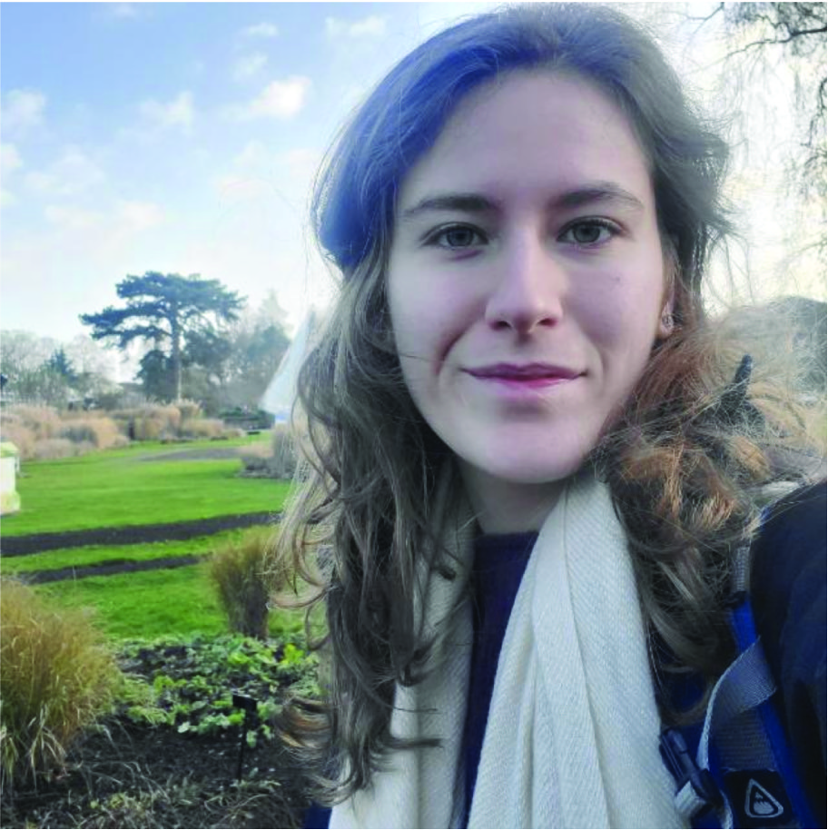

  
  
Current supervisions and co-supervisions  

  
  

  
{}  
  
Raquel Pizzardo  
(USP, Brazil)  
Raquel is working with species distribution modelling and approaches to combine evolutionary history with conservation policies. She is interested to explore the relationship between geographical distribution, evolutionary processes and diversification, focusing on “sky island” systems and expanding this knowledge to analyses of conservation. raquelcp@usp.br 

  

{}  
  
MSc. Patricia Sperotto   
(UEFS, Brazil)  
Patrícia is a botanist whose research focuses primarily on climbing plants. In her MSc, she revised the terminology used in describing the climbing habit and explored the role of climbing mechanisms in the distribution and diversification of neotropical climbing plants. She is currently looking for a PhD to further develop her skills in macroevolution, phylogenetic comparative methods and biogeography. patriciassperotto@gmail.com  

  

{}  
  
MSc. Lílian Melo  
(UFU, Brazil)  
Lílian is an ecologist with a great interest in plant-pollinator interactions and macroevolutionary questions related to this topic. Currently, her research is mainly focused on the classification, evolution and distribution of species with pollen flowers. lilian.melo@ufu.br

  

